# On-Line Exam System  :
<br>

## Technologies are used :
  - Front-end : Bootstrap, JQuery, CSS, HTML
  - Back-end : Laravel Framework (PHP)
  - Database : Mysql
<br>
__ [This Project based on LaraQuiz project](https://github.com/LaravelDaily/Laraquiz-QuickAdminPanel) __
<br><br>

## Usage: (First you need to install composer, and you need a mysql server that contain a database with name "online_exam"(don`t forget to change the database credentials in `.env` file))
<br>


```shell
$ git clone https://github.com/Auto-Rooter/Online-Exam-System.git && cd Online-Exam-System

# Download all required packages
$ composer install

# Create all related tables
$ php artisan migrate

# Seed the tables (users, roles)
$ php artisan db:seed

# Run the server
$ php artisan serve


```
<br>
<br><br>


## Login:
<br>
- You can login with an account added by the admin only :
<br>
__  (also only emails end with domain : `.uni-miskolc.hu` ) __
<br><br>

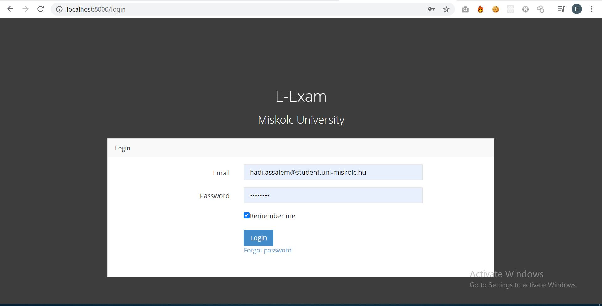

## Users managment:
<br><br>
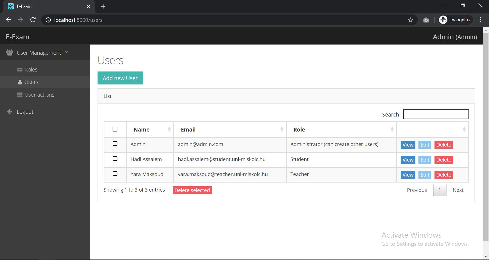

<br><br>


## Teacher Section :
<br><br>
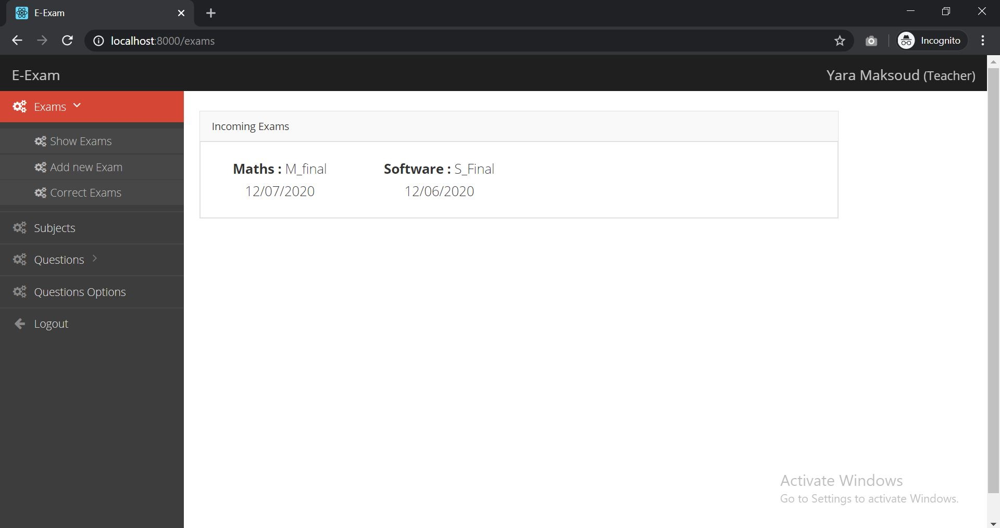

<br>

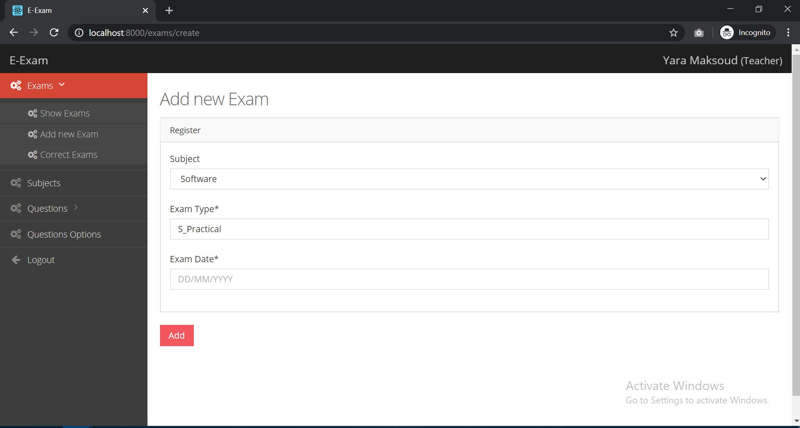

<br>

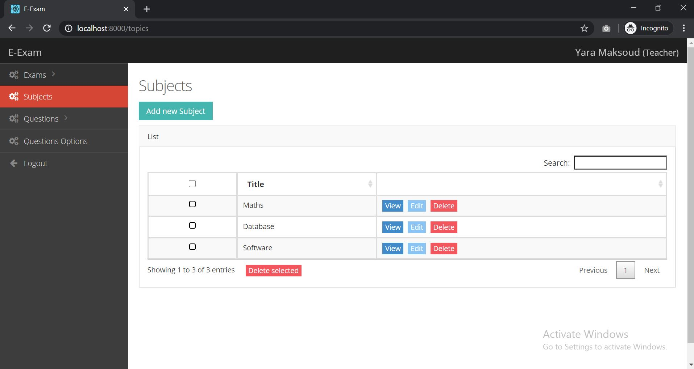

<br>
- Add new Multi-Choices Question:
<br>

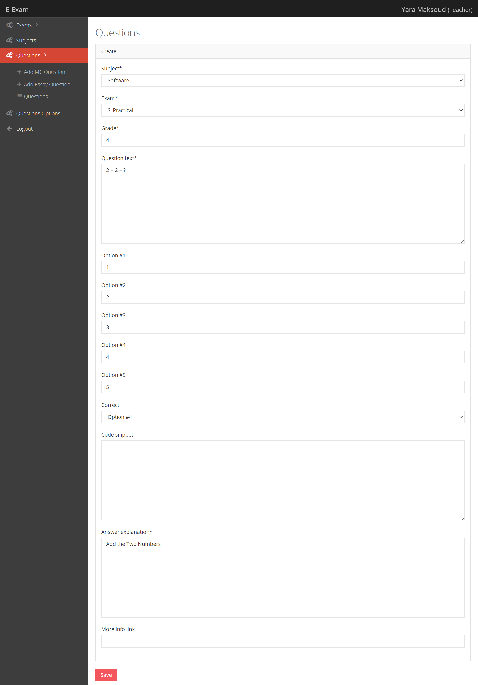

<br>
- Add new Essay Question:
<br>

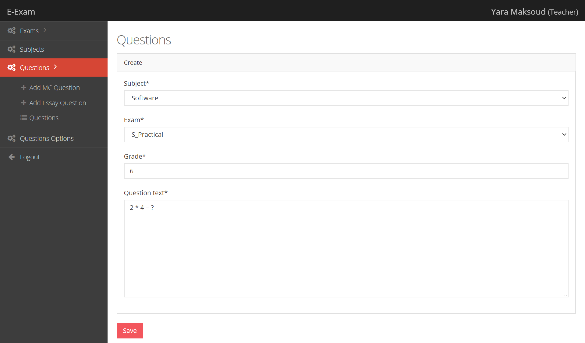

<br><br>

## Student Section:
<br>
- Student Incoming Exams and registered Subjects:
<br>

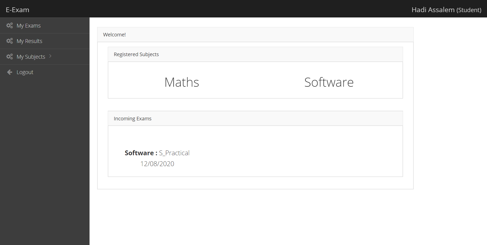


<br>
- Exam:
<br>

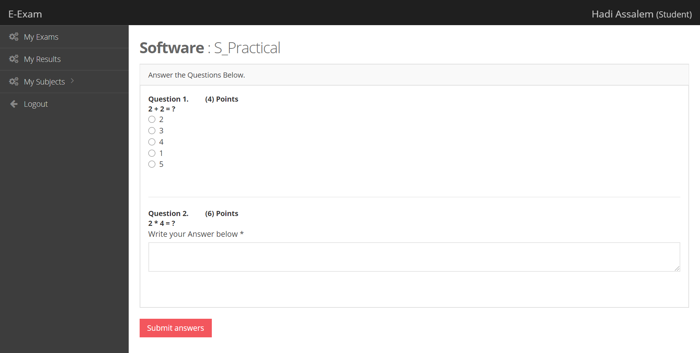


<br>
- Student Result (before Teacher correct the Essay Questions):
<br>

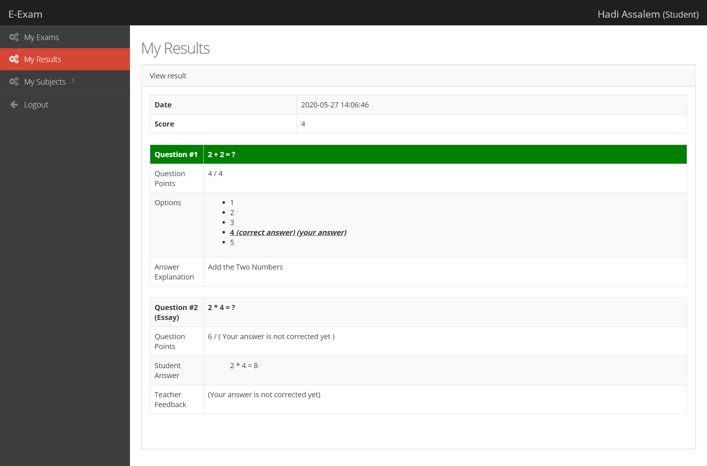


<br>
- Teacher (List of Essay Questions to be corrected):
<br>

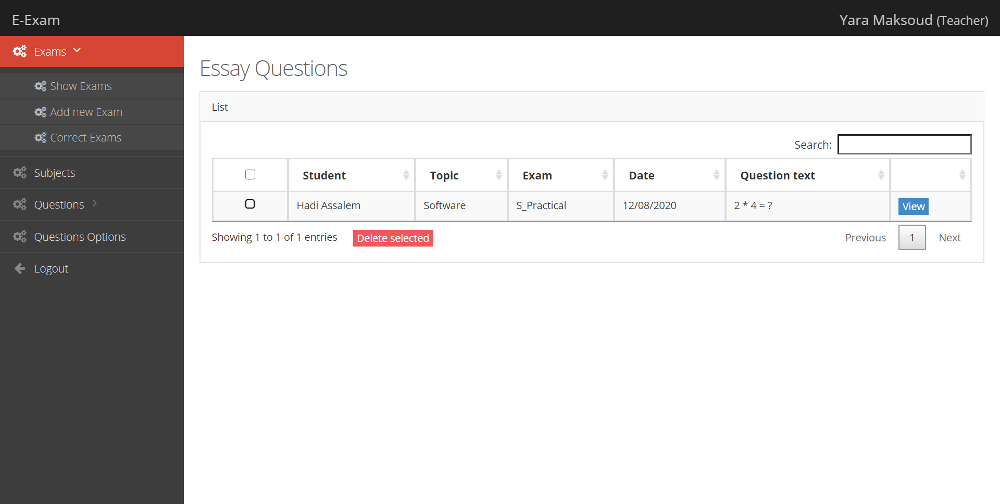


<br>
- Correct Question:
<br>

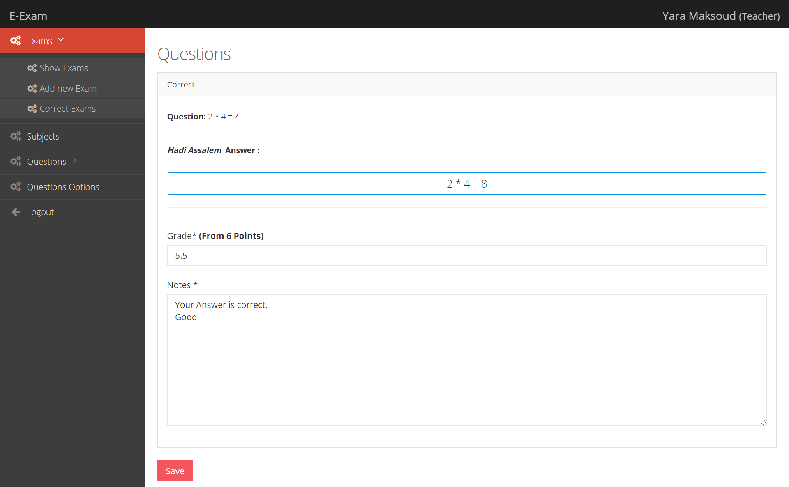


<br>
- Student Final Result:
<br>


<br>


